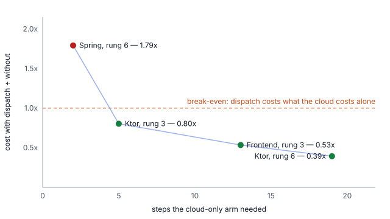

# Delegating coding work to a local model: a measurement study

August 2026. 216 valid samples, two clients, three codebases, six task shapes, three refactor
strategies, and one debugging probe.
One Apple M4 Max, 48 GB unified memory, `mlx-community/Qwen3.6-35B-A3B-OptiQ-4bit`, a mixed
4/8-bit build, served by mlx-lm 0.31.3 on mlx 0.32.0.

## Abstract

We measure whether a cloud coding agent can offload work to a local model on a developer
machine at lower cost and equal quality. Under GitHub Copilot's token billing, a local
model draws no AI credits, so the question is which work it can take.

With a cloud orchestrator (Claude Sonnet 4.6) and an available local worker, delegation
is bimodal. It never occurs on 16 samples of question-answering and comment-writing, and
always occurs on 20 samples of mechanical multi-file edits. Where it occurs on a Ktor
service, cost falls 1.24x (n=5+5, p=0.004) and 2.54x (n=12+8, p=0.002) at identical
verification outcomes. An installed but unused dispatch instruction costs 2%.

**The saving is not a property of the codebase but of how hard the task is for the cloud
model.** The same task on a Spring service costs 1.79x *more* with delegation than without
(n=8+8, p=0.0074), where on Ktor it cost 0.39x: opposite sign, same model, orchestrator and
harness, quality unaffected in both. Across four paired experiments the ratio orders
monotonically by one variable, and it is not the language. It is the number of steps the
*cloud-only* arm needed: 19 steps 0.39x, 13 steps 0.53x, 5 steps 0.80x, 2 steps 1.79x.
Delegation pays where the cloud model would otherwise grind, and costs money where it
would finish in two steps. The control arm measures this before anyone commits to
dispatching. See §7.2 and §7.3; any decision resting on "2.54x" as a general figure should
rest on those instead.

Run without an orchestrator, the local model completes a 46-reference rename across 10
files unaided in both attempts, at zero credits, but writes no file at all when asked to
create one (0/3), and fixes none of three failing tests whose cause is not stated (§7.4). Within the six shapes tested we find no difficulty ceiling. The
distinction is between applying a decision and making one.

An intervention that rewrote the dispatch instruction to encourage delegation increased it
on one task shape (0/6 to 2/6). One of the two delegated samples failed verification while
the four that did not delegate all passed, indicating the original refusal was correct.

## 1. Question

Nav pays for GitHub Copilot by token. Since 1 June 2026 the unit is the AI credit, $0.01,
drawn down by input, output and cached tokens at each model's published rate. A model
served from the developer's own machine draws none.

The question is therefore not whether a local 35B model matches Claude Sonnet, which it
does not, but whether a subset of coding work exists that it can take at acceptable cost
in latency and error.

## 2. Method

### 2.1 Configurations

Two clients support different architectures, and both were measured.

**opencode** binds a local model as a sub-agent under a cloud orchestrator. Arms are
dispatch enabled (*hybrid*) against dispatch disabled (*control*), with the same cloud
model driving both. This isolates delegation as the single variable.

**Copilot CLI** resolves one provider per session, so the orchestrated architecture cannot
be expressed. Arms are whole-session-local against whole-session-cloud.

All runs are launched through `nav-pilot`, the tool developers use, rather than against the
model API. The unit under test is the product.

### 2.2 Tasks

Six shapes on a Nav Kotlin service, pinned commit, ordered by an a priori difficulty
estimate: (1) answer a question about the code, (2) add a doc comment, (3) rename a symbol
across call sites, (4) write a new unit test file, (5) thread a field through a DTO,
(6) thread a field through a data class, its mapper and every construction site.

Three targets, each at a pinned commit, each verified by its own suite:
`navikt/isoppfolgingstilfelle` (Ktor), `navikt/ia-tjenester-metrikker` (Spring) and
`navikt/familie-tilbake-frontend` (React 19 and Express 5 on Node 24). The shapes are
analogous rather than identical across targets, which is why every comparison in §7.2 and
§7.3 is a paired hybrid-against-control within one codebase and the ratios are never
averaged across them.

Each sample resets the working tree to the pinned commit, so no sample observes another's
output. Each is a fresh client session, because prompt-cache reuse across turns would
otherwise make task order a variable.

### 2.3 Measures

**Cost** is read from the client, not computed. opencode reports a per-step cost; the
Copilot CLI reports AI credits in its session summary. An earlier harness priced tokens from
a published rate table, which introduces a second source of error whenever a rate or
promotional discount changes.

One exception, stated because it is an assertion rather than a reading: a whole-session-local
run draws no credits by construction, and the harness records zero rather than parsing a
figure the client does not print. In the three earliest Copilot task files that field is null
instead, from a harness that predates it; Table 2 reports both as zero, which is the one
place in this report where an unknown and a measured zero are shown alike.

**Quality** is the repository's own checks: compilation, absence of the renamed symbol, and
no test failing that was not already failing. The model's report of its own success is
never used. The target's suite fails on an untouched checkout (15 classes, embedded
PostgreSQL does not start on this hardware), so samples are compared against a baseline
failure set measured once per commit rather than against a green suite.

**Delegation** is counted from the local server's request log over the sample window, not
from the transcript.

**Excluded attempts** are kept in the result files rather than deleted, and two are worth
naming because both strengthen the findings they sit behind. Task 4 on the Copilot CLI has
11 invalid attempts behind its 3 valid ones, all recorded as sessions that never finished,
so that task is worse than 0/3 alone conveys. Strategy B in the refactor has three attempts killed
after the server hung, preserved in `bench/refactor-b-preserialise.json` alongside two that
completed; §6 is what the kills were, and §3.3 reports the post-fix run instead.

### 2.4 Validity controls

The harness refuses rather than reports a doubtful number. Each sample asserts its arm's
configuration artefacts: a hybrid sample lacking the worker binding, dispatch fragment or
provider block is invalid, not a result. It will not start when the client binary can change
mid-run, when another benchmark runs, or above a load-average ceiling. A sample exiting
successfully in under two seconds with no model step is invalid, as is one whose delegation
count contradicts its label.

## 3. Results

### 3.1 Orchestrated delegation (opencode)

Table 1. Cloud cost per completed task, median. All arms verified all samples.

| Task | Delegated | Hybrid | Control | Ratio | p |
|---|---|---|---|---|---|
| 1, answer a question | 0/8 | $0.080 | $0.078 | 0.97 | |
| 2, add a doc comment | 0/8 | $0.094 | $0.092 | 0.98 | |
| 3, rename across call sites | 8/8 | $0.085 | $0.106 | 1.24 | 0.004 |
| 6, thread a field through a mapper | 12/12 | $0.134 | $0.339 | 2.54 | 0.002 |

p values are one-sided Mann-Whitney U on per-sample cost, computed by the exact
enumeration in `bench/analyse.py`. Task 3's cost comparison is n=5+5, not 8+8: three
samples per arm were taken before the harness recorded per-step cost, and they contribute
to the delegation count but not to the cost test.

Delegation is bimodal rather than graded. In 16 samples of tasks 1 and 2 it never occurs;
in 20 samples of tasks 3 and 6 it always does. The orchestrator is not evaluating each
instance and occasionally accepting: the same shape gets the same answer every time.

**The instruction names some of those shapes, and this section cannot separate the two.**
The dispatch fragment in the system prompt tells the orchestrator to send lookups, comments,
log lines, a single test file, and mechanical changes following one pattern, adding that a
rename hits call sites in several files and belongs there anyway; and to keep changes
needing a judgement per file. So the delegation of tasks 3 and 6 is consistent with the
model following an instruction that describes them, and §3.4 shows the rate is
instruction-sensitive. What the instruction does not explain is the refusal: it tells the
orchestrator to send lookups and comments, and in 16 samples it never did. The honest
statement is that instruction and model jointly produce this pattern, and that the model
overrides the instruction in the direction of doing more itself.

A consequence for anyone repeating this: the fragment has since been edited to state the
conclusion this report draws, so a rerun against the current text measures compliance rather
than judgement. The text the measured runs saw was 1572 bytes and is recorded per sample in
the result files.

Cost falls 19% on the rename and 61% on threading a field through a mapper and its
construction sites. Two points is a direction, not a scaling law, but it is consistent
with the saving tracking the mechanical fraction of the work. Verification is unaffected.

Tasks 1 and 2 measure the overhead of the dispatch instruction in isolation, since the
hybrid arm there is the control plus an unused instruction in the system prompt. The
difference is $0.002, or 2%.

### 3.2 Unorchestrated local sessions (Copilot CLI)

Table 2. Whole session on each provider, median.

| Task | Local verified | Local credits | Local wall | Cloud verified | Cloud credits | Cloud wall |
|---|---|---|---|---|---|---|
| 1, answer a question | 3/3 | 0 | 18s | 2/2 | 7.2 | 12s |
| 2, add a doc comment | 3/3 | 0 | 24s | 2/2 | 8.8 | 19s |
| 3, rename across call sites | 3/3 | 0 | 58s | 3/3 | 8.5 | 16s |
| 4, write a new unit test file | **0/3** | 0 | 55s | 3/3 | 28.9 | 85s |
| 5, thread a field through a DTO | 3/3 | 0 | 39s | 3/3 | 15.2 | 36s |
| 6, thread a field through a mapper | 7/12 | 0 | 146s | 8/8 | 67.3 | 288s |

Failures do not follow the difficulty ordering. Task 5 verifies 3/3 at the cloud's latency
for no credits, while task 4, estimated easier, produces zero lines of output in three
attempts. Task 4 requires creating a file that does not exist. This matches the
refusal-to-edit category in EDIT-Bench (arXiv:2511.04486), one of four failure classes
that benchmark names for instructed code editing.

Task 6 gave 1/3 at n=3 and 7/12 at n=12, so the small sample understated the rate about
twofold. At n=12 the local arm is also faster (146s against 288s). Failure here is
deterministically detectable, so retry-until-success averages 1.7 attempts, still below the
cloud arm's latency and at zero credits.

### 3.3 Refactor: 46 references, 10 files

Three strategies. C is the cloud alone, A is the whole job handed to the local model, B is
the cloud specifying each file and dispatching it one at a time.

Table 3. One rename, n=2 each. All six samples removed all 46 references across all 10
files and left the project compiling, and all six agree with the cloud-only reference file
for file.

| Strategy | Wall | Credits | Local calls |
|---|---|---|---|
| C, cloud only | 28s, 44s | 21, 14 | 0 |
| A, local only | 171s, 332s | **0, 0** | 11, 5 |
| B, cloud decomposes and dispatches per file | 87s, 153s | 19, 16 | 21, 46 |

**Strategy A was predicted to fail.** The spec predicted it would, on the grounds that a
monolithic instruction is what a user attempts first and the cascade literature holds that a
small model cannot carry it. It succeeded in both attempts at zero credits, and it is the
only strategy that costs nothing.

Strategy B does not reproduce the cascade result here. It costs about what the cloud alone
costs (19 and 16 credits against 21 and 14) while taking two to five times as long, and it
is the most expensive way to get an outcome the other two also reached. Cascaded editing
(arXiv:2604.19201) reports the decomposed form beating the large model alone on tasks
containing a decision to be made. A rename contains none, so decomposition here buys nothing
and is charged for the orchestration.

What B is not is slower than A: at 87 and 153 seconds it beat A's 171 and 332. An earlier
draft of this report said B underperformed A on every axis, from a run taken before the
concurrency fix in §6; that run is kept in `bench/refactor-b-preserialise.json` and the
claim was wrong. On this task the ordering is C fastest, then B, then A, and the credit
ordering is the reverse.

The three deterministic checks are the same for all six samples and are the reason this
table is short: the old symbol is gone, the project compiles, and the resulting files match
the cloud-only run exactly.

### 3.4 Prompt intervention

The dispatch instruction was rewritten to lead with cost rather than failure modes, on the
hypothesis that tasks 4 and 5 were never delegated because the original text read as a
warning. Six samples per arm, same commit and model, instruction as the only difference.

Table 4. Delegation and verification before and after.

| Task | Before | After |
|---|---|---|
| 4, write a new unit test file | 0/6 delegated | 2/6 delegated |
| 5, thread a field through a DTO | 0/6 | 0/6 |

The change on task 4 is not significant alone (one-sided Fisher exact p = 0.227; six per
arm detects only large effects). The verification outcome is the informative result: of the
two delegated samples, one introduced a new failing test, while all four non-delegated
samples verified in roughly a third of the wall time. The orchestrator's refusal to
delegate task 4 was correct, and the intervention degraded outcomes. It was reverted.

This inverts the reading of §3.1. Zero delegation on tasks 1, 2 and 4 is discrimination,
not reluctance, and it outperformed the instruction written to override it.

## 4. Threats to validity, and four we realised

Four claims made during this work were later contradicted by measurement.

1. **A ceiling was reported that does not exist.** After task 4 failed we concluded the
   local model tops out at task 3. Task 5 then verified 3/3, so the organising distinction is
   not difficulty. Naming what it is instead takes care: task 4 is fully specified, so
   nothing about it requires a decision, and calling its failure "makes decisions badly"
   overreaches. What task 4 asks for that no other task does is a file that does not yet
   exist. The distinction this report defends is applying against creating-or-deciding, and
   the create half rests on one task.
2. **A kernel panic was attributed to our configuration.** Two panics during benchmarking
   named the GPU driver in the panic file, and we recorded the raised wired-memory limit as
   destabilising. Those strings occur in the system-wide thread inventory, both parked in
   `TH_WAIT`, and in neither trace. The panicking task was a virtualisation daemon; the two
   backtraces are one code path once address randomisation is removed; the fault class is a
   memory-tagging trap, not memory exhaustion.
3. **Eighteen samples measured nothing and scored zero.** The client's auto-update replaced
   the binary mid-run with a build lacking launch flags, so each launch printed usage text
   and exited successfully. The harness had warned about auto-update and proceeded.
4. **The intervention in §3.4 was expected to improve delegation and degraded it.**

Known remaining threats. Cost is dominated by prompt-cache reads (91 to 97% of tokens),
which bill at a tenth of fresh input, so any comparison in raw token totals overstates the
difference; all figures here are priced. Samples within an arm run minutes apart and share
a server-side cache, which affects per-sample cost but not the arm comparison. The refactor
agreement measure compares strategies against the cloud-only run, so a misunderstood task
would mark all agreeing strategies correct; it selects what to inspect, not what is right.

## 5. Instrumentation failures

Five defects in the measurement apparatus were found and fixed. All share one shape: a run
producing plausible output while measuring nothing.

- The target's suite is red on an untouched checkout, so quality was being judged against an
  unreachable green. Samples are now compared to a per-commit baseline.
- The fix for that admitted a worse defect. `git clean` preserves `build/` to keep Gradle
  warm, so a change that fails to compile leaves the previous run's test results in place,
  the baseline diff finds nothing new, and a broken build scores as a pass. Results are now
  cleared before each run and their absence is an explicit compile failure.
- Invalid samples satisfied the sample quota, so three failures produced a complete-looking
  file containing nothing. Valid samples are counted, with an attempt cap.
- `Popen.wait(timeout=2400)` was observed 13 minutes past its deadline with the child alive.
  The cap is now enforced against a monotonic clock and tested against a process that ignores
  SIGTERM. That fix reached the ladder harness and not the refactor one, which is why two
  §3.3 runs recorded 3192s and 3846s against a 2400s cap and were killed by hand: their
  `timed_out` field says false because a human, not the harness, ended them. Both are in
  `refactor-b-preserialise.json` and neither is reported as a result. The refactor harness
  now shares the same cap.
- No load check existed. After a reboot, filesystem indexing at load average 16 would have
  been recorded as model latency.

Each guard is a refusal rather than a warning, because in every case a warning existed and
did not prevent the run.

## 6. An upstream defect with product consequences

Instructed to work file by file, the orchestrator enumerated all 10 files and dispatched 10
sub-agents concurrently. mlx-lm batched the concurrent requests into shared attention;
differing prompt lengths raised `[broadcast_shapes] Shapes (1,1,1,12919) and
(1,16,1,14896)`, leaving the server accepting connections and answering none, unrecoverable
without restart. It reproduced on the following sample, which recorded no local calls
because the server was already dead.

The defect is upstream (ml-explore/mlx-lm #1139, #1256, the latter against the pinned
0.31.3) and reachable from normal use, since fanning a refactor across files is an obvious
orchestration strategy. Mitigation is to serialise completions at the proxy already fronting
the server. One model on one GPU cannot serve a second concurrent stream, so the requests
queued regardless; they now queue where they cannot corrupt a cache.

## 7. Conclusion

The results reduce to one distinction. Given a decision already made, this model applies it
across ten files at no credit cost. Asked to make the decision, it declines or produces a
defect.

That is a finding about the model, and it held on every codebase tested. The economics did
not: delegating the mechanical work costs 0.39x on Ktor and 1.79x on Spring. The distinction
above tells you what the model can do; it does not tell you whether doing it is worth paying
for.

What decides that is §7.3. Across four paired experiments the ratio orders by how many steps
the cloud-only arm needed, not by the language: 19 steps 0.39x, 13 steps 0.53x, 5 steps
0.80x, 2 steps 1.79x. Delegation pays where the cloud model would otherwise grind and costs
money where it would finish in two steps, and the control arm measures which you have before
you commit to anything.

Four independent measurements support it: the orchestrator delegating exactly the mechanical
shapes (§3.1), unorchestrated sessions succeeding on specified edits and failing to create a
file (§3.2), a full rename completing locally and unaided (§3.3), and decomposition adding
cost to a task with no decision in it (§3.3, strategy B).

## 7.1 Every measurement here was taken through Norwegian instructions

The worker agent and the dispatch fragment were written in Norwegian throughout the
measurements. They are English now, on the grounds that neither is user-facing, but the
change matters to how this report should be read.

Qwen3.6 is trained mostly on English and Chinese. Instruction-following is the capability
that degrades first in a low-resource language, and this report's central failure mode is
that the model reads a task, explains what should change, and edits nothing. That is also
what a model does when it half-understands an instruction. So an unknown share of what is
reported here as the model's behaviour may be the behaviour of the model given instructions
in a language it handles less well.

Three samples of rung 6 with English instructions dispatch 3 of 3 and verify 3 of 3, with a
median of 22 local calls against 13 for the Norwegian arm, so nothing broke and the
orchestrator delegated more of the work. The cost went the other way, $0.157 against $0.134.
None of that is a finding at n=3, and the fragment's wording changed alongside its language,
so the comparison is not clean. It is enough to say the switch is safe and not enough to say
what it is worth.

The two rungs where the orchestrator never delegates have now been rerun in English, and
they answer the sharpest version of the question:

| rung | Norwegian | English |
|---|---|---|
| 4, write a new unit test file | 0/6 delegated | 0/6 delegated, 6/6 verified |
| 5, thread a field through a DTO | 0/6 delegated | 0/6 delegated, 6/6 verified |

Identical. The refusal in §3.1 is not an artefact of instructions the orchestrator half
understood: it declines these two task shapes just as consistently when told in English, and
the sessions verify either way. §3.4's finding that overriding the refusal made results worse
therefore stands on its own rather than on a translation.

What remains unmeasured is the other direction. Rung 6 in English dispatched more (22 local
calls against 13) at slightly higher cost, on three samples. Whether English changes how much
gets delegated where delegation already happens is open; whether it changes *whether* it
happens on these two rungs is answered, and the answer is no.

## 7.2 The saving does not transfer to Spring

Every number above is from a Ktor service. Spring is most of what Nav runs in production, and
the first alpha user is more likely to work in it. Rung 6, the task that carries the headline,
run against `navikt/ia-tjenester-metrikker` at a pinned commit, n=8 per arm:

| rung 6 | hybrid | control |
|---|---|---|
| median cost | **$0.164** | **$0.092** |
| range | $0.093–$0.256 | $0.090–$0.612 |
| delegated | 8/8 | 0/8 |
| verified | 8/8 | 8/8 |

Dispatch costs **1.79x** as much on Spring (one-sided Mann-Whitney p=0.0074), against 0.39x
on Ktor. Same task shape, same model, same orchestrator, same harness, opposite sign at the
same sample size and a comparable p value.

Anything built on "2.54x" as a general figure is built on one Ktor service. What replaces it
is §7.3.

One asymmetry worth noting rather than smoothing: the control arm's range runs to $0.612,
against a median of $0.092. The cloud arm on Spring occasionally does something expensive,
and the median hides it. The hybrid arm is tighter and dearer.

## 7.3 What actually predicts the saving

An earlier draft of this report concluded that the saving is a property of the model, the
architecture *and the codebase*. The codebase turned out to be a proxy.

Reading the four arms already collected, the ratio orders by one variable: how many steps the
**cloud-only** arm needed to finish the task. Where the cloud model grinds, handing the
mechanical part to a local worker removes most of the grinding. Where it walks the task in two
steps, dispatch adds an orchestration round trip and costs more than it saves.

| Codebase | Rung | Control steps | Hybrid | Control | Ratio | n |
|---|---|---|---|---|---|---|
| Ktor | 6 | 19 | $0.134 | $0.339 | **0.39** | 12+8 |
| Frontend, TypeScript | 3 | 13 | $0.121 | $0.227 | **0.53** | 8+8 |
| Ktor | 3 | 5 | $0.085 | $0.106 | **0.80** | 8+8 |
| Spring | 6 | 2 | $0.164 | $0.092 | **1.79** | 8+8 |

Figure 1. The same four points as Table 5. Below the dashed line delegation saves money;
above it, delegation costs more than not delegating. Regenerated by `mise run analyse`.

Table 5. Delegation ratio against the control arm's median step count. `bench/analyse.py`
recomputes the ordering and asserts it is monotone.

The frontend row is the only one collected after the hypothesis existed, and it was
**predicted before it ran**. The prediction, the statistic, the test and the labels were
written to `reports/night-plan-2026-08-31.md` and committed before the first sample: a
control arm at five steps or more predicts a ratio below 1.0. The control arm came in at 13
steps and the ratio at 0.53, one-sided exact Mann-Whitney p=0.0023, n=8+8, with zero invalid
samples in either arm and 8 of 8 verified in both. The target was
`navikt/familie-tilbake-frontend` at a pinned ref, React 19 and Express 5 on Node 24,
verified by its own suite of 61 files and 572 tests.

Two things this does not establish. TypeScript is better represented in the model's training
data than Kotlin, so a cheaper TypeScript result cannot separate "step count drives the ratio"
from "the model is simply better at TypeScript"; what the table does show is that the ratio is
not a property of the language alone, because Ktor appears twice with different ratios. And
four points ordering correctly is a relationship, not a fitted model: the break-even sits
somewhere between 2 and 5 control steps, and nothing here locates it more precisely.

Why the step count differs between codebases remains unmeasured. Spring's annotation and
injection style spreads a change across more files with less local context in each, which is
the shape that should cost an orchestrator round trips whether or not it delegates. That is a
hypothesis, not a finding.

For anyone deciding whether to adopt this, the practical form is: run the task once without
delegation and count the steps. That number, not the language, says whether dispatch will pay.

## 7.4 It does not debug

Every task above is read-or-apply-a-specified-edit. Debugging is the shape the
applying-versus-deciding distinction predicts it should fail, and it does.

Three failing tests on a green baseline of 61 files and 572 tests, no cause stated, one
attempt each:

| Task | Break | Distance from symptom | Result |
|---|---|---|---|
| X1 | wrong locale in `utils/land.ts` | test file beside it | failed, 782s, 38 tool calls |
| X2 | inverted predicate in `utils/sider.ts` | same directory | failed, 504s, 36 tool calls |
| X3 | `stores/sidebarStore.ts` opens shut | two directories away | timed out at 900s |

**0 of 3.** Each attempt changed exactly one file and left the suite red.

Neither completed attempt touched a test file. Weakening an assertion was the cheap way
through every one of these tasks and it was not taken, so these are three honest failures
rather than three attempts to game the oracle. The easiest case failed too: X1's break is a
wrong locale in a function whose test sits in the same directory and names the expected
values, with 17 tests failing and saying what they wanted.

What this measures is fault localisation when a failing test already points at the behaviour,
which is the easiest tier of debugging. Reproduction, usually the hard part, is not measured
at all. n=1 per task, so the claim is "0 of 3" and never a rate.

## 7.5 The model comparison, and what a second run did to it

This section said the rejection of `Qwen3.8-27B` rested on a chat template written here rather
than shipped with the model. That was wrong in a way worth recording, and the conclusion it
guarded has since been replaced by measurement rather than argument.

**The confound was narrower than stated.** Our template only ever reached the abliterated oMLX
build. The published verdict came from `mlx-community/Qwen3.8-27B-8bit` served by mlx-lm
through the model's own template — the same conditions as the winner. Worse, `MLX_CHAT_TEMPLATE`
never worked on the mlx-lm path at all: `--chat-template` takes the template text and the
harness passed a path, so the path became the template and every prompt rendered to a filename.
No run in this report was served through the hand-written template.

**The template breakage is a server contract, not a defect.** Nine of ten cached templates
raise on tool arguments in the OpenAI wire format, and the Jinja environment transformers
exposes has no JSON parsing filter, so no template can fix it. Every one of them requires the
server to parse arguments into a mapping first. mlx-lm does. Ollama does not read Jinja at all.
The row belongs in a compatibility note, not in a defect list.

**Ten runs on 3 September replace the rejection.** Five samples per model, on a harness with
git hidden from the agent, compile and test verification requiring the diff to touch the file
the prompt names, and the served model asserted against the profile:

| model | verified per run | mean | median |
|---|---|---|---|
| `qwen3.6-35b-a3b-optiq` | 2, 3, 2, 4, 3 | 2.80 | 3 |
| `qwen3.8-27b-4bit` | 4, 4, 2, 4, 4 | 3.60 | 4 |

Every run scored all 11 tasks; 7 or 8 of them are judged automatically per run, and the rest are
manual or retired. Exact two-sided Mann-Whitney U by enumeration gives U = 19 over 252
arrangements, so **p = 0.21**. The floor for five runs against five is 2/C(10,5) = 0.008, which
p = 0.21 sits far above. **This experiment could not separate the two models.** That is neither
a finding that 3.8 is better nor a finding that the two are equivalent, and five runs an arm are
too few to decide it.

Two earlier versions of this table read differently. The first reported 5.75 against 3.40 and
concluded Qwen3.8 solved more; it was measured before the models could compile, against
workspaces four days apart in commit, so it compared two models writing Kotlin blind. The second
reported 3.75 against 3.25 at p = 0.71, on four runs an arm, before git hiding and real
verification landed. The ordering has held across all three harnesses and the size of the gap has
not, and it has not been statistically significant on any harness that measured what it claimed
to measure.

Qwen3.8 is also less predictable and about seven times slower. That is why it ships as an opt-in
alternative with the range in its description, while `Qwen3.6-35B-A3B-OptiQ` remains the default
on the strength of its 216 samples.

**The methodological point outranks the model one.** Every reversal here came from a second run
existing, not from better reasoning. This report's model table was built from single runs, and
single runs are anecdotes with numbers attached. n>=5 before a row informs advice, and publish
the individual runs rather than a summary statistic, so a reader can see the spread the summary
hides. The clearest case: on the broken harness, Qwen3.8's average moved from 4.80 to 5.75 on one
run being quarantined, and the difference between those two numbers was the difference between
p = 0.175 and p = 0.016, between a claim that cannot be published and one that barely can. 0.016
was the floor there: with four runs against five there are 126 arrangements, so no two-sided p
below 2/126 is obtainable. Neither number survived the harness repair. A mean alone shows none of
that.
Outstanding samples are tracked in
[navikt/copilot#564](https://github.com/navikt/copilot/issues/564).

## 8. Limitations

The delegation pattern in §3.1 is measured against an instruction that names some of the
shapes it reports, and §3.1 says so. Anyone rerunning it should read the fragment first.

Table 1's task 6 is n=12 hybrid against n=8 control because the hybrid arm received a later
top-up batch that the control did not. On the first 8 hybrid samples the ratio is 2.95
rather than 2.54, so the extra batch weakened the reported effect rather than flattering it,
but the asymmetry is there and has no methodological justification beyond the order the runs
happened in.

Two cells of Table 2 hide a wide spread: task 3 local has a 308-second sample against
siblings at 51 and 58, and task 6 cloud spans 52 to 1601 seconds. The medians are honest;
the ranges are not visible in the table.

One model, one machine, one repository, and for most task shapes a single task instance. The
Kotlin service represents Nav's newer backends and nothing else; TypeScript and React have no
sample size worth reporting.

Sample sizes of 8 to 12 detect the effect sizes reported and would not detect small ones.
Delegation rates of 0/16 and 20/20 are unambiguous; the intervention in §3.4 is not.

Nothing here measures sustained use. These are single tasks in a clean repository with no
interruption, no partial work in progress and no concurrent demand. That supports offering
the capability to volunteers. It does not support recommending a change in how a team works.

## References

- EDIT-Bench, instructed code editing failure categories: arXiv:2511.04486
- Cascaded code editing, large model sketches and small model applies: arXiv:2604.19201
- mlx-lm concurrent request defects: ml-explore/mlx-lm issues #1139, #1256
- Copilot billing model and per-token rates: docs.github.com/copilot/reference/copilot-billing
- Method and task definitions: `bench/ESCALATION_SPEC.md`, `bench/REFACTOR_SPEC.md`
- Raw samples: `bench/hybrid-*.json`, `bench/copilot-*.json`, `bench/refactor-*.json`
- Every median and p value in this report: `python3 bench/analyse.py`
